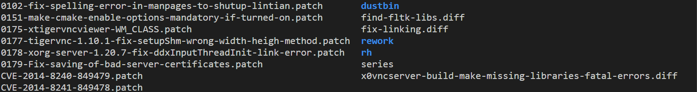

# BinPool

<p align="center">

</p>

## Table of Contents
- [Introduction](#introduction)
- [Access](#Access)
- [Features](#features)
- [Installation](#installation)
- [Usage](#usage)
- [Contributing](#contributing)
- [License](#license)

## Introduction

BinPool is a dataset consisting of vulnerable and patched binaries derived from historical Debian packages. BinPool can be used for vulnerability discovery tasks through various methods, including machine learning, fuzzing, and more. BinPool contains #number of binaries and #number of functions. It covers # of different CWE types. BinPool provides different features as follows.
You can find the BinPool paper in . 

## Access
You can download the dataset from . 

## Features

- It Provides # number of unique CVEs and the corresponding CWE.
- For each CVE, it provides the fix version of the debian package. 
- It provides the primary programming language (C, C++, java, python)
- It provides function names exits in the patch and corresponding line numbers.
- It provides memory offsets inside binary the involve in the patch

## Installation

If you want to build BinPool, follow these steps. 

We built BinPool by integrating debian snapshot , NVD and debian security tracker. You can access the link of binpool
records from https://docs.google.com/spreadsheets/d/1qztIwB8xJ10H-2HLX15vI29Ze7yFDOrv7kDQ4JUi1g8/edit?usp=sharing. 

For each CVE in the link above, grab the corresponding fix version. This is the version of the package that fix this CVE. For each CVE, there are more than one fix version but you can try to grab anyone. Note that usually if the version is higher, it is more likely to get built. 

1. After finding the Debian package, visit the Debian snapshot site (https://snapshot.debian.org/). On the left sidebar, under the "Packages" section, select "Source Packages" and enter only the source name of the package (for example, for the package `tigervnc_1.7.0-2`, just type `tigervnc`). This will display all available versions of the package. Select the desired version, such as `1.7.0-2` in this case.On the version page, you will find both the source files and binary packages. Thanks to the Debian community, all source packages are pre-built and available for download. The binaries contain only patched functions. Since we need to build both the vulnerable and patched versions, and compile binaries with different optimization levels, we will need to download the source files for this purpose.Under source files section, right click on ```package_version.dsc``` and copy the link address. We also provide you an autmated script to find this source link. 


2. **The most important and challenging part of debian packages is to find the right debian version to build the debian package.**. We provide an automated script to find a right debian version for each package. Having a right debian version is neccessary to guarantee  the installation of debian dependencies. 

3. Now it is time to install the right version of debian. You can install it using virtual machines but we prefer to install it using ```debootstrap```. debootstrap is a tool used to create a minimal Debian-based (or Ubuntu-based) system installation within a directory. It is typically used to bootstrap a new Debian system by downloading essential packages, installing them, and setting up the directory structure needed for a basic system. Follow the following commands. First install deboostrap. 

```bash
sudo apt-get update
sudo apt-get install debootstrap
sudo mkdir /mnt/debian # make a directory to install the debian inside it.
```

Now install the debian using debootstrap. Imagine that we want to install debian 10 or (buster) in directory /mnt/debian10. 

```bash
sudo debootstrap --arch amd64 buster /mnt/debian http://deb.debian.org/debian
sudo chroot /mnt/debian

```

chroot changes the apparent root directory for a process, isolating it from the rest of the system by making it operate within a specified directory as if it were the root (/).

4. You are now inside the debian you just installed. It is now time to install the debian package. Run the following commands. 

```
apt-get update
apt-get install -y --force-yes build-essential fakeroot devscripts packaging-dev
```
Now make a directory for the vulnerable version of the package. 

```
mkdir vulnerable
cd vulnerable
```

Now download the source file you just obtained from the first step by running find_debian_version.py. Run the following command.

```
dget -u --insecure source_file_url
```

As an example, it can be like ```dget -u --insecure https://snapshot.debian.org/archive/debian-debug/20161230T030620Z/pool/main/t/tigervnc/tigervnc_1.7.0-2.dsc```.

Now you have downloaded the package in directory vulnerable. **Inside every debian package, there is a directory called /debian/patches/. This directory contains all patches applied into this package. As an example for ```tigervnc_1.10.1%2Bdfsg-4```, you can see this list of patches. 




If you open the series file, you will see the list of patches. The Debian community provides an awesome tool named ```quilt``` to apply or remove patches from source code. Quilt uses a file called series to track the list of patches and their order. The patches are applied one after another in the order they are listed in the ```debian/patches/series``` file. The command ```quilt push``` will apply the patch and ```quilt pop``` will remove the patch. In order to find out the applied patches run 

```
quilt applied
```

To know more about quilt please refer to https://raphaelhertzog.com/2012/08/08/how-to-use-quilt-to-manage-patches-in-debian-packages/.

Then you can remove the patch that fix the CVE by using the following command.

```
quilt pop CVE-2014-8240-849479.patch
```
You can also revert all patches by using 

```
quilt pop -a
```

Now it is time to build package dependencies. Thanks to debian community, you can build all dependencies by using following command.It will use debian/rules to build the package.

```
apt build-dep .
```
It is neccessary that this phase should be successfully done.  

You can now install the package for different optimization levels. We build the packages with debug information(dwarf).

```
#optimization level 0
yes '' | DEB_BUILD_OPTIONS='nostrip noopt debug' dpkg-buildpackage -b -uc -us
```

```
#optimization level 1
export CFLAGS="-O1"
export CXXFLAGS="-O1"
export FFLAGS="-O1"
export DEB_BUILD_OPTIONS="nostrip debug"
dpkg-buildpackage -b -uc -us
```
```
#optimization level 2
export CFLAGS="-O2"
export CXXFLAGS="-O2"
export FFLAGS="-O2"
export DEB_BUILD_OPTIONS="nostrip debug"
dpkg-buildpackage -b -uc -us
```

```
#optimization level 3
export CFLAGS="-O3"
export CXXFLAGS="-O3"
export FFLAGS="-O3"
export DEB_BUILD_OPTIONS="nostrip debug"
dpkg-buildpackage -b -uc -us
```

For patch version, just apply the patch using following command. 

```
quilt push file.patch
```
to apply all patches run. 

```
quilt push -a
```
and then build dependencies and the package using above commands. If this step goes through successfully, then the deb files are created. To extract the binaries from debian files, run the following command for each deb package. 

```
dpkg-deb -x <package_name>.deb <output_directory>
```
5. Now run the ```binpool_info.py``` script. This script will give you some information such as function names, the bin file contain the vulnerable function, file names involve in the patch and all lines that contain the patch. 


# Trouble Shooting

1. Please remember that building these packages is not an easy task. You may encounter so many technical issues. I recommend to always choose the higher version as a fix version. 

2. quilt may sometimes have a bug. It sometimes gives error to apply the patch and in this case I just choose another option

3. If you cannot build a package do not spend much time on it. Try to choose those that you can build faster. 

# Dataset Structure

the structure of the dataset should follow the below pattern. 

```
CVE-ID/
│
├── vulnerable/                # Directory containing vulnerable versions
│   ├── opt0/                  # optimization level 0 for vulnerable version
│   ├── opt1/                  # optimization level 1 for vulnerable version
│   ├── opt2/                  # optimization level 2 for vulnerable version
│   └── opt3/                  # optimization level 3 for vulnerable version
│
└── patch/                     # Directory containing patched versions
    ├── opt0/                  # optimization level 0 for patched version
    ├── opt1/                  # optimization level 1 for patched version
    ├── opt2/                  # optimization level 2 for patched version
    └── opt3/                  # optimization level 3 for patched version

```

# Tasks 

I chose CVEs randomly from remaining CVEs and splited them betwen us. In order to find out what CVEs you have to build, please follow the step below. 

load the file with your name in the tasks directory using the following code.

```
import joblib

sima_tasks = joblib.load('tasks/sima.pkl') # to load CVEs sima has to compile
```

Please remember that in the file https://docs.google.com/spreadsheets/d/1qztIwB8xJ10H-2HLX15vI29Ze7yFDOrv7kDQ4JUi1g8/edit?usp=sharing, the green records are those that I have built. I exclude them from the rests and then assigned the remaining CVEs. Please mark the records in the sheet when you build it. 